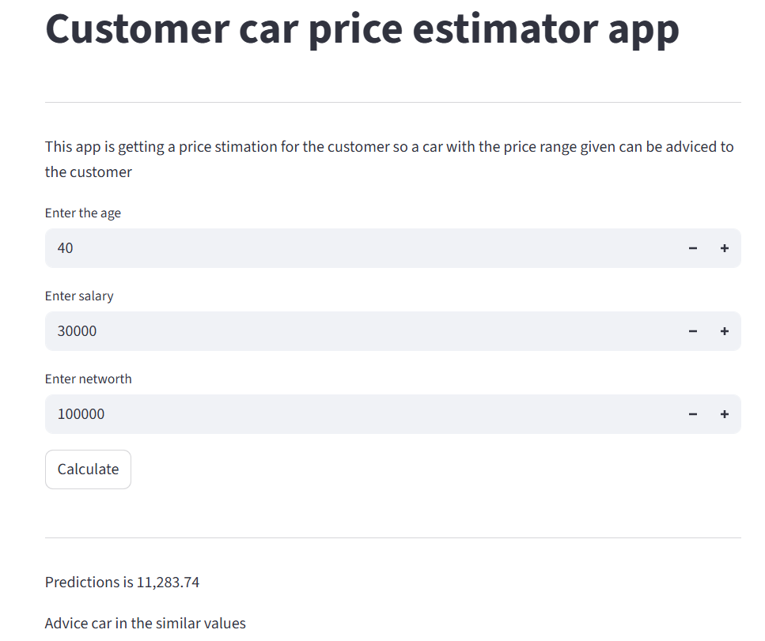

# Sales Prediction Portal

In this project, I created a machine learning system to estimate how much a customer might spend on a car.

### What I did:
1. **Data Analysis:** I explored a dataset of customer information (like age, salary, and net worth) to see what factors influence car buying.
2. **Machine Learning:** I trained a Linear Regression model that can predict the purchase amount based on a customer's profile.
3. **Web App:** I built a simple website using Streamlit where anyone can enter their details and get an instant price estimation.

### How it works:
The app takes three inputs:
*   **Age**
*   **Annual Salary**
*   **Net Worth**

Once you hit "Calculate," it uses my trained model to show a predicted car price range.
